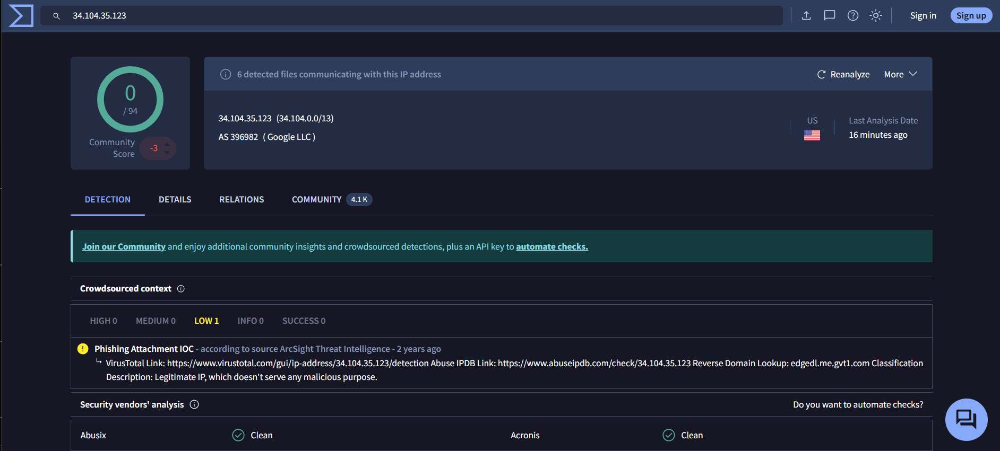
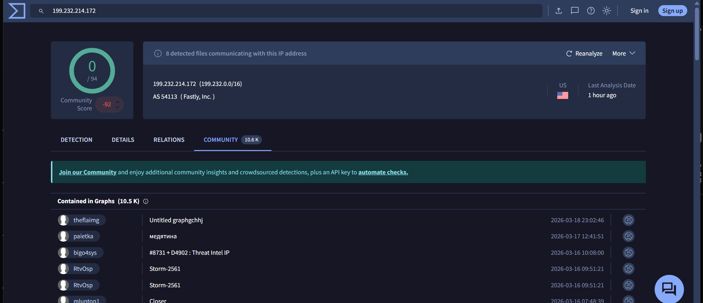
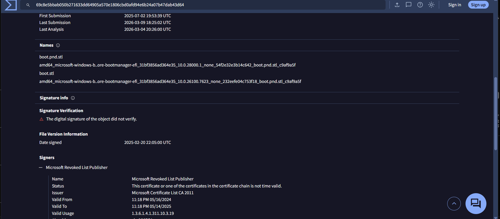
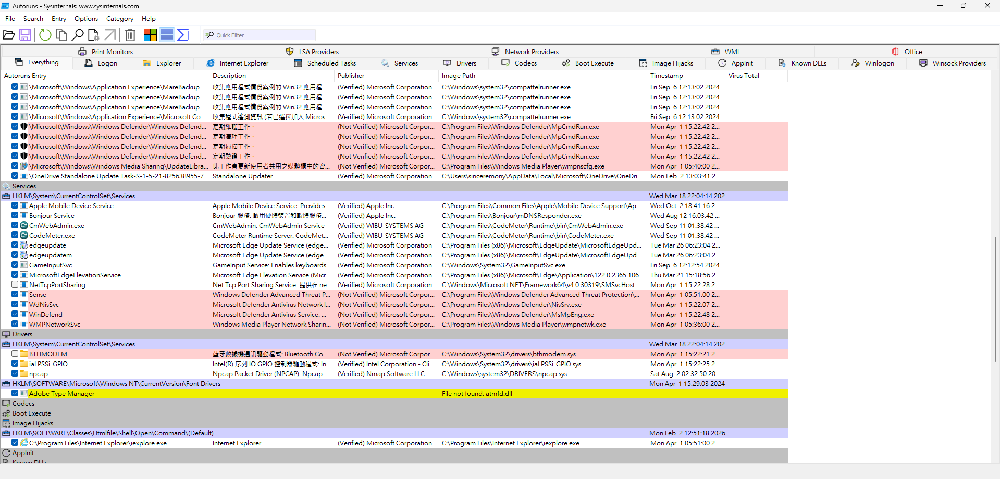

# Side-project3: Threat Hunting
# 1. C2
### Phase.1 Forensic
目前在這三部主機中找到的已知惡意IP清單如下：
IP From
34.104.35.123 -
150.171.27.10 -
150.171.27.11 -
150.171.28.10 -
### Phase.2 Honeypot
3.169.55.17 simplewall
20.49.150.241 simplewall
20.99.186.246 Lucky mouse
23.248.249.10 Xiaozhiyun+L.L.C
### Phase.3 Trace DNS
34.104.35.123 edgedl.me.gvt1.com

199.232.214.172 [ctldl.windowsupdate.com, msedge.b.tlu.dl.delivery.mp.microsoft.com]

### Phase.4
- sysmon
- pcap + sslkey
- zeek
- rita

# 2. Event
### Security
- 4648: A logon was attempted using explicit credentials.
### System
**Shutdown-mod1**
- 1074: The process C:\WINDOWS\system32\shutdown.exe (DESKTOP-U41K20Q) has initiated the shutdown of computer DESKTOP-U41K20Q on behalf of user DESKTOP-U41K20Q\sinceremony for the following reason: No title for this reason could be found
 Reason Code: 0x800000ff
 Shutdown Type: shutdown
 Comment: 
- 6013: The system uptime is 11 seconds.
- 109: The kernel power manager has initiated a shutdown transition.
- 13: The operating system is shutting down at system time ‎2026‎-‎03‎-‎17T14:15:31.695827100Z.
- 12: The operating system started at system time ‎2026‎-‎03‎-‎18T03:51:08.500000000Z.
- 20: The last shutdown's success status was true. The last boot's success status was true.

**Shutdown-mod2**
- 1074: The process C:\Windows\SystemApps\Microsoft.Windows.StartMenuExperienceHost_cw5n1h2txyewy\StartMenuExperienceHost.exe (DESKTOP-U41K20Q) has initiated the power off of computer DESKTOP-U41K20Q on behalf of user DESKTOP-U41K20Q\sinceremony for the following reason: Other (Unplanned) Reason Code: 0x0 Shutdown Type: power off
- 187: User-mode process attempted to change the system state by calling SetSuspendState or SetSystemPowerState APIs.
- 42: The system is entering sleep.Sleep Reason: Application API 
- 6013: The system uptime is 115265 seconds.
- 107: The system has resumed from sleep.
- 1: The system has returned from a low power state.
Sleep Time: ‎2026‎-‎02‎-‎12T09:08:48.587133000Z
Wake Time: ‎2026‎-‎02‎-‎13T08:49:06.877654200Z

# 3. Persistent
- [bootloader, master boot record, volume boot record, recovery disk...]
- [boot folder, **BCD**(Boot Configuration Data)]
```powershell
Directory: Z:\EFI\Microsoft\Boot

Mode                 LastWriteTime         Length Name
----                 -------------         ------ ----
d-----         1/25/2026   6:13 AM                bg-BG
d-----         1/25/2026   6:13 AM                CIPolicies
d-----         1/25/2026   6:13 AM                cs-CZ
d-----         1/25/2026   6:13 AM                da-DK
d-----         1/25/2026   6:13 AM                de-DE
d-----         1/25/2026   6:13 AM                el-GR
d-----         1/25/2026   6:13 AM                en-GB
d-----         1/25/2026   6:13 AM                en-US
d-----         1/25/2026   6:13 AM                es-ES
d-----         1/25/2026   6:13 AM                es-MX
d-----         1/25/2026   6:13 AM                et-EE
d-----         1/25/2026   6:13 AM                fi-FI
d-----         1/25/2026   6:13 AM                fr-CA
d-----         1/25/2026   6:13 AM                fr-FR
d-----         1/25/2026   6:13 AM                hr-HR
d-----         1/25/2026   6:13 AM                hu-HU
d-----         1/25/2026   6:13 AM                it-IT
d-----         1/25/2026   6:13 AM                ja-JP
d-----         1/25/2026   6:13 AM                ko-KR
d-----         1/25/2026   6:13 AM                lt-LT
d-----         1/25/2026   6:13 AM                lv-LV
d-----         1/25/2026   6:13 AM                nb-NO
d-----         1/25/2026   6:13 AM                nl-NL
d-----         1/25/2026   6:13 AM                pl-PL
d-----         1/25/2026   6:13 AM                pt-BR
d-----         1/25/2026   6:13 AM                pt-PT
d-----         1/25/2026   6:13 AM                qps-ploc
d-----         1/25/2026   6:13 AM                qps-plocm
d-----         1/25/2026   6:13 AM                ro-RO
d-----         1/25/2026   6:13 AM                ru-RU
d-----         1/25/2026   6:13 AM                sk-SK
d-----         1/25/2026   6:13 AM                sl-SI
d-----         1/25/2026   6:13 AM                sr-Latn-RS
d-----         1/25/2026   6:13 AM                sv-SE
d-----         1/25/2026   6:13 AM                tr-TR
d-----         1/25/2026   6:13 AM                uk-UA
d-----         1/25/2026   6:13 AM                zh-CN
d-----         1/25/2026   6:13 AM                zh-TW
d-----         1/25/2026   6:13 AM                Fonts
d-----         1/25/2026   6:13 AM                Resources
-a----         3/18/2026  10:06 PM          36864 BCD
-a----          1/9/2026   9:22 AM          11733 boot.pnd.stl
-a----          1/9/2026   9:22 AM          58776 kdnet_uart16550.dll
-a----          1/9/2026   9:22 AM          87424 kdstub.dll
-a----          1/9/2026   9:22 AM          71072 kd_02_10df.dll
-a----          1/9/2026   9:22 AM         562592 kd_02_10ec.dll
-a----          1/9/2026   9:22 AM          71064 kd_02_1137.dll
-a----          1/9/2026   9:22 AM          99752 kd_02_1414.dll
-a----          1/9/2026   9:22 AM         284048 kd_02_14e4.dll
-a----         3/31/2024  11:22 PM          11030 boot.stl
-a----          1/9/2026   9:22 AM        2855368 bootmgfw.efi
-a----          1/9/2026   9:22 AM        2837416 bootmgr.efi
-a----          1/9/2026   9:22 AM          91552 kd_02_15b3.dll
-a----          1/9/2026   9:22 AM          83328 kd_02_1969.dll
-a----          1/9/2026   9:22 AM          71056 kd_02_19a2.dll
-a----          1/9/2026   9:22 AM          62864 kd_02_1af4.dll
-a----          1/9/2026   9:22 AM          83328 kd_02_1d0f.dll
-a----          1/9/2026   9:22 AM         361872 kd_02_8086.dll
-a----          1/9/2026   9:22 AM          58784 kd_07_1415.dll
-a----          1/9/2026   9:22 AM          87440 kd_0C_8086.dll
-a----          1/9/2026   9:22 AM        2605952 memtest.efi
-a----          1/9/2026   9:22 AM          58792 kd_02_15ad.dll
-a----          1/9/2026   9:22 AM         164752 SecureBootRecovery.efi
-a----         3/31/2024  11:22 PM          10341 winsipolicy.p7b
```
### Analysis
-  A standard Windows EFI partition typically contains `boot.stl` (which you have), but `boot.pnd.stl` is **not** a native Windows boot file.
- You have a long list of files starting with `kd_02_...` and `kdstub.dll`. 
- **`boot.stl` and `winsipolicy.p7b`**: Dated **3/31/2024**. 
### What AI think is happening
Your system has all the "ingredients" for a **BlackLotus** or similar UEFI bootkit:
1.  **Presence of `boot.pnd.stl`**: A known artifact of bootkit staging.
2.  **Revoked Signature**: Confirmed by VirusTotal, meaning the file is an exploit tool.
3.  **Clean BCD Path**: This suggests the malware is sitting *underneath* the OS, likely having replaced a core boot file with a vulnerable-but-signed version to maintain stealth.



# File
- timestamp
- artificat string
- PE Header
### route.exe
### autorun


### boot.pnd.stl